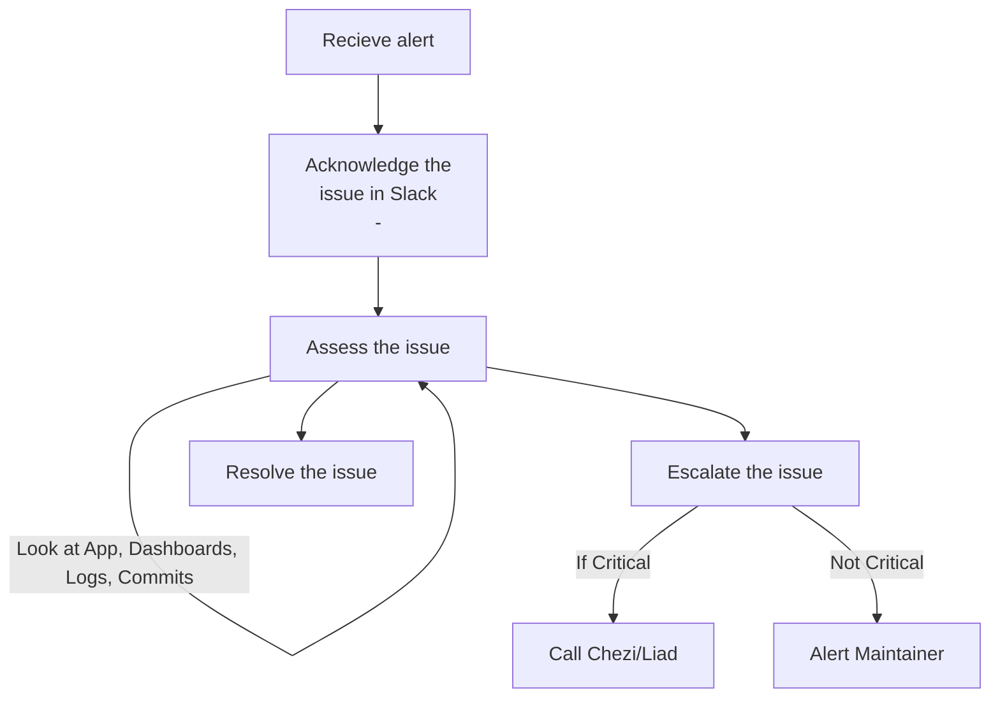

```mermaid
flowchart TB
    A[Recieve alert] --> B[Acknowledge the<br> issue in Slack<br>-]
    B --> C[Assess the issue]
    C -- Look at App, Dashboards, Logs, Commits --> C
    C --> D[Escalate the issue]
        C --> E[Resolve the issue]
        D -- If Critical --> F[Call Chezi/Liad]
        D -- Not Critical --> G[Alert Maintainer]
```