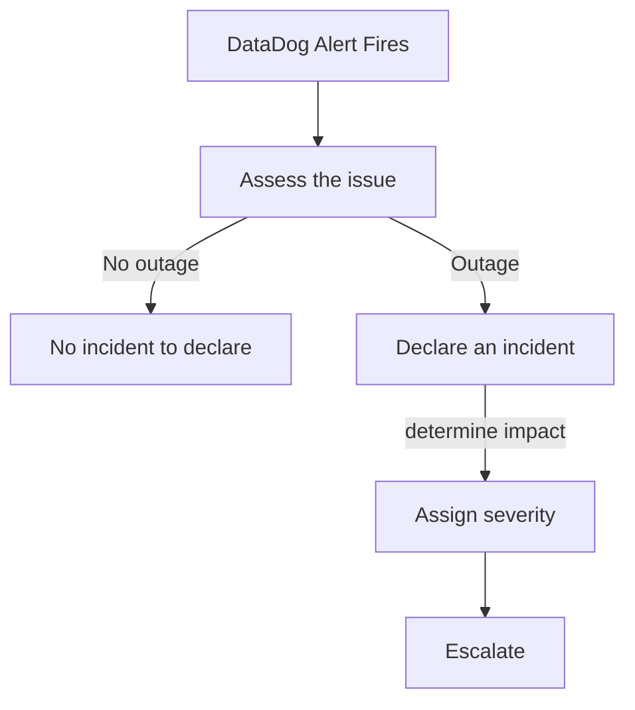

## Decision tree

## Incident declaration

Within a datadog monitor, you can declare an incident by clicking the "Declare Incident" button. This will trigger an incident report in Datadog, and notify within Slack under `incident-<severity>` channel.

## Slack Notifications

 

As the incident progresses, Datadog will update the Slack channel with the status of the incident. This is done by updating the incident report in Datadog.

## Impact Identification

 

## Severity determination

 

## Escalation path

Depending on the severity of the incident, you may need to escalate the incident to the next level of support. This can should be based on your best judgement, and the severity of the incident.

We cover this more in depth in the [Escalation](/oncall/escalate) page.

## Incident resolution

Once the incident is resolved, you can resolve the incident in Datadog by clicking the "Resolve Incident" button. This will update the incident report in Datadog, and notify within Slack under `incident-<severity>` channel.

## Last Month Incident Report

https://us5.datadoghq.com/dash/integration/incident_management_overview?from_ts=1689706095776&to_ts=1692384495776&live=true

 