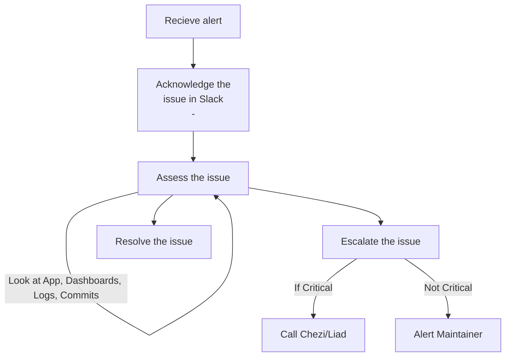

## Step 1: Acknowledge the issue

1. ack within opsgenie
1. Add the `:ack:` emoji to the slack thread (acknowledged)
1. add the priority `:p1:` … `:p5:`
1. Start a thread on the issue, like `"Looking into it..."` (communication for this issue will happen in this thread)

## Step 2: Asses the issue

1. Look at the DD dashboard
    1. Start looking if we have errors - in case you have you can go to the logs by clicking on “Runtime Logs”   
1. Look at the latest github commits to see if some change aligns with the alert timeframe,
1. Look for anomalies or correlations from datadog 

### Communicate updates

1. Keep the slack thread updated with your progress. Even small messages like `"I looked at the logs but didn't notice anything odd"` or `"This looks correlated to {X}, but I'm not sure how"` are useful!
1. Sometimes you’ll be able to find the error and feel free to submit a PR to fix it!

## Step 3: Escalate the issue

In the slack alert datadog will list the official maintainers for the piece of code that was written, and the last person to deploy the service. If you’re unsure of the next step, contact these people to see if they have ideas about what might be wrong.

## Optional: Resolve the issue:

### If you found the issue, and fixed it, update the Slack thread!