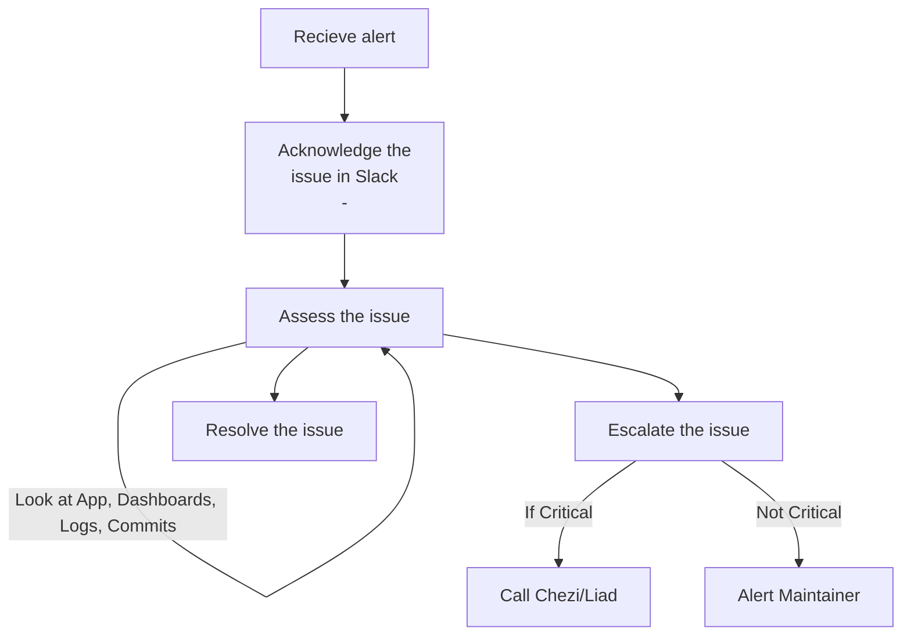

## Step 1: Acknowledge the issue

1. ack within opsgenie
1. "ack" the message with an emoji
1. investigate, and assign a P priority 1-5 emoji
1. create a thread, and investigate/brain dump

## Step 2: Asses the issue

Check to see if code has changed or deployed recently

1. Has someone pushed out code that is broken?
1. Check the latest commits in github

## Step 3: Escalate the issue