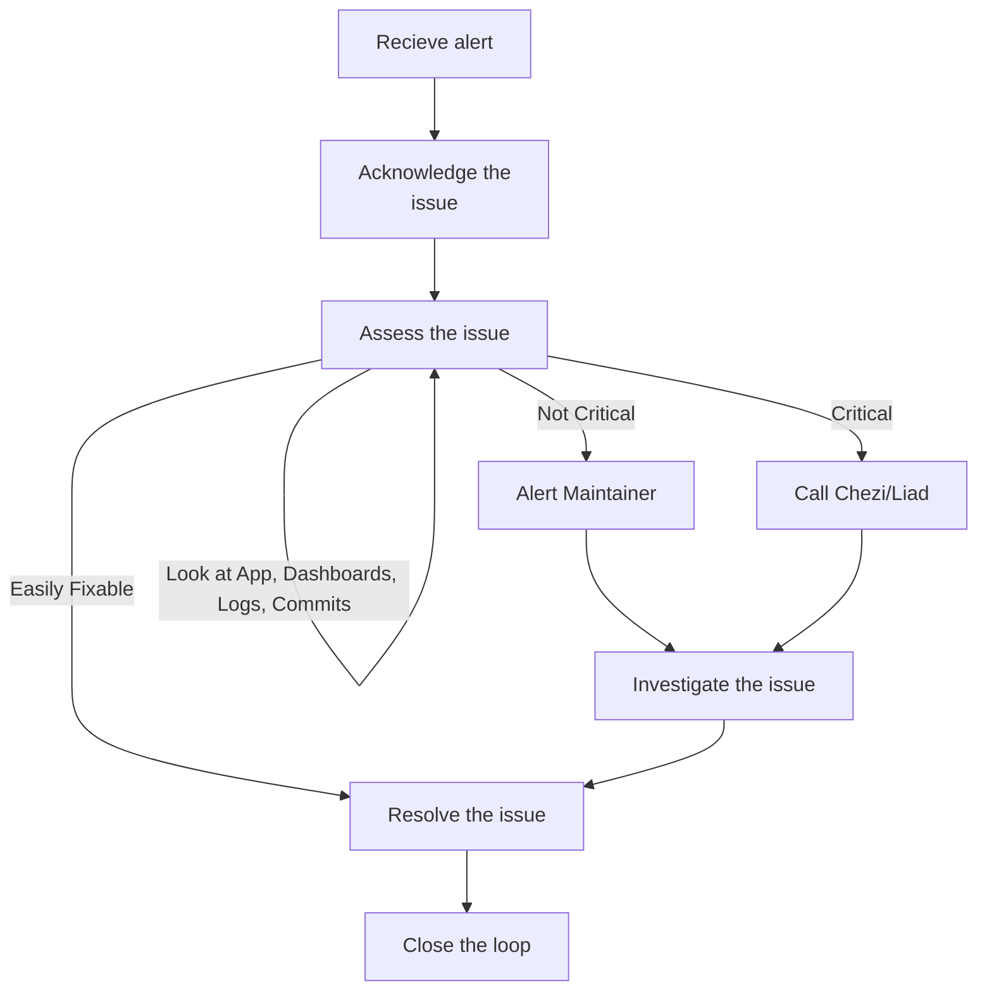

## Step 1: Acknowledge the issue

1. `ack` within opsgenie
1. Add the `:ack:` emoji to the slack thread (acknowledged)
1. add the priority `:p1:` … `:p5:`
1. Start a thread on the issue, like `"Looking into it..."` (communication for this issue will happen in this thread)

## Step 2: Asses the issue

### Investigate the issue

1. Look at the DD dashboard
1. Look at the latest github commits to see if some change aligns with the alert timeframe,
1. Look for anomalies or correlations from datadog

### Communicate updates

1. Keep the slack thread updated with your progress. Even small messages like `"I looked at the logs but didn't notice anything odd"` or `"This looks correlated to {X}, but I'm not sure how"` are useful!
1. Sometimes you’ll be able to find the error and feel free to submit a PR to fix it!

## Step 3: Escalate the issue

In the slack alert datadog will list the official maintainers for the piece of code that was written, and the last person to deploy the service. If you’re unsure of the next step, contact these people to see if they have ideas about what might be wrong.

If you’re still unsure, contact Chezi or Liad.

## Optional: Resolve the issue (if you can)

If you found the issue, and fixed it, update the Slack thread!

If you feel you can contribute to the fixing of the bug in any meaningful way, please do! The more brains we have on the issue, the better!

PRs are always welcome, and if you’re unsure about the fix, feel free to ask for help!

## Closing the loop

Once the issue is resolved, close loop within the slack thread.

Usually the fixer of the issue will close the issue, but if that ends up being you, please don't forget to do so!

Ideally, you can provide a sentence-or-two summary of what happened, and what the fix was. Code is even better! This helps document the entire engagement for future on-callers.
