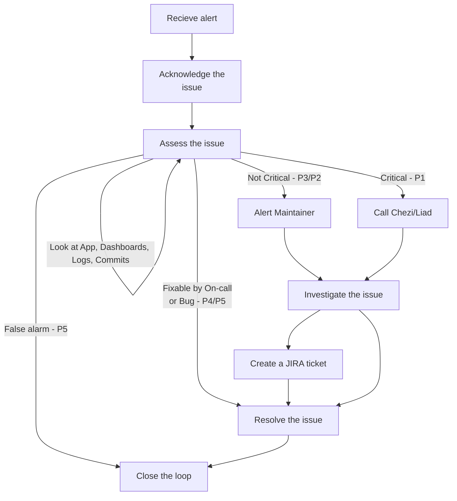

## Step 1: Acknowledge the issue

1. `ack` within opsgenie
1. Add the `:ack:` emoji to the slack thread (acknowledged)
1. Start a thread on the issue if relevant, like `"Looking into it..."` (communication for this issue will happen in this thread)
1. add the priority `:p1:` … `:p5:`
    - `P5` - false alarm or known bug
    - `P4` - not critical, but should be investigated and fixed at some point
    - `P3` - unsure, should investigate and notify maintainer for follow up
    - `P2` - critical, should investigate and notify maintainer immediately
    - `P1` - most critical, notify up the chain until someone responds above yourself
1. If an issue, declare an incident within Datadog

## Step 2: Asses the issue

### Investigate the issue

1. Look at our App
    1. Is it down?
    1. Is it slow?
    1. Is it throwing errors?
    1. Are there missing pieces of functionality?
1. Look in Datadog
    1. View the **Dashboard** for the affected service(s)
        1. We have a dashboard for each service; [they can all be found here](https://us5.datadoghq.com/dashboard/lists)
    1. View the **APM** for related services
        1. [APM for TW Gateway](https://us5.datadoghq.com/apm/services/tw-gateway/operations/express.request/resources?env=shofifi&fullscreen_end_ts=1690396913450&fullscreen_paused=false&fullscreen_start_ts=1690393313450&resources=qson%3A%28data%3A%28visible%3A%21t%2Chits%3A%28selected%3Atotal%29%2Cerrors%3A%28selected%3Atotal%29%2Clatency%3A%28selected%3Aavg%29%2CtopN%3Aall%29%2Cversion%3A%210%29&summary=qson%3A%28data%3A%28visible%3A%21t%2Cerrors%3A%28selected%3Aratio%29%2Chits%3A%28selected%3Arate%29%2Clatency%3A%28selected%3Alatency%2Cslot%3A%28agg%3A99%29%2Cdistribution%3A%28isLogScale%3A%21f%29%29%2Csublayer%3A%28slot%3A%28layers%3Aservice%29%2Cselected%3Apercentage%29%29%2Cversion%3A%211%29&topGraphs=latency%3Alatency%2Chits%3Aversion_count%2Cerrors%3Aversion_count%2CbreakdownAs%3Apercentage&start=1690393313450&end=1690396913450&paused=false)
        1. [APM for affected service(s)](https://us5.datadoghq.com/apm/home?env=shofifi)
    1. Compare the [**dynamic range**](https://en.wikipedia.org/wiki/Dynamic_range) to the last 5-15 min, 1-4 hours, 1-3 days
        1. This should give us an idea of "normal" behavior vs what we are getting notified about
    1. View **Runtime Logs** and do the same
        1. Top left of APM has links to GCP runtime logs
        1. The dashboard will show an error graph for the given time period
        1. Errors within logs are usually indicative of a problem, especially if there isn't a history in the past
1. Look in Slack
    1. Search the `#datadog-alerts` channel for similar issues
        1. Searching for the error or endpoint *should* yield some results from the past
        1. You may be able to glean a solution (if they exist, and the fix was documented)
    1. Search the `#cloud-alerts` channel for correlated errors
        1. Could correlate to a datadog alert through pubsub/endpoint call in another service
        1. Could be the root cause of a datadog alert
1. Look at the latest Github commits
    1. See if some change aligns with the alert timeframe
    1. Look for anomalies or correlations from datadog

After looking at the app, dashboards, messages and logs, you should have a good idea of what the issue is, and how to proceed.

**NOTE:** As a general rule, if the app is working, it's not a critical issue. If not, it is.

### Communicate updates

1. Keep the slack thread updated with your progress. Even small messages like `"I looked at the logs but didn't notice anything odd"` or `"This looks correlated to {X}, but I'm not sure how"` are useful!
1. Sometimes you’ll be able to find the error and feel free to submit a PR to fix it!

## Step 3: Escalate the issue

In the slack alert, datadog will list the official maintainers for the piece of code that was written, and the last person to deploy the service. 

### Alert maintainer

If you’re unsure of the next step, contact these people to see if they have ideas about what might be wrong.

### Declare an incident

In datadog, you can declare an incident once you visit the link associated with the alert. 

This will send a message to Opsgenie, and notify the proper channels according to our oncall rules.

Feel free to continue communicating within the slack thread, but this will help notify the proper people.

### Contact Chezi/Liad

If you’re still unsure, or have run out of options, contact Chezi.

Only contact Liad as a last resort.

## Optional: Resolve the issue (if you can)

If you found the issue, and fixed it, update the Slack thread!

If you feel you can contribute to the fixing of the bug in any meaningful way, please do! The more brains we have on the issue, the better!

PRs are always welcome, and if you’re unsure about the fix, feel free to ask for help!

## 🦖 Creating a JIRA ticket

If a lower priority issue is found, and you don't have tge time or knowledge to fix it, create a JIRA ticket.

This is imoprtant as things left in Slack are quickly forgotten, and we want to make sure we don't lose track of the issue. JIRA is the way we do this 😎

## Closing the loop

Once the issue is resolved, close loop within the slack thread, and/or in JIRA.

Usually the fixer of the issue will close the issue, but if that ends up being you, try to remember this last step!

Ideally, you can provide a sentence-or-two summary of what happened, and what the fix was. Code is even better! This helps document the entire engagement for future on-callers.
